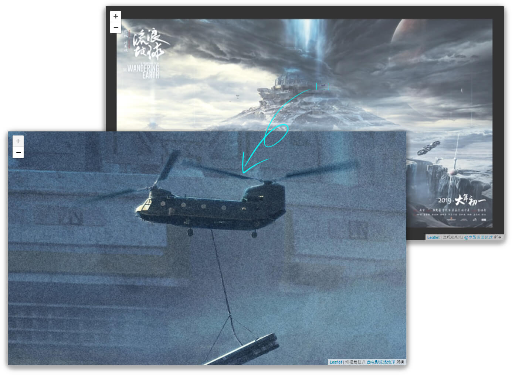

# 《流浪地球》行星发动机全景海报

在线浏览地址：https://sneezry.com/thewanderingearth/



海报图片版权归其创作者所有。此代码仓库中的图片块（images tiles）是在《流浪地球》原高清海报图片基础上切割制成，没有进行任何修改，其版权归《流浪地球》海报创作者所有。

Leaflet相关文件（`leaflet.js`和`leaflet.css`）版权归`Leaflet`所有，授权方式以Leaflet为准。

其它文件以[The Unlicense](https://github.com/Sneezry/thewanderingearth/blob/master/LICENSE)协议在公共域发布。

## 如何下载

由于文件数量庞大，不建议使用 Git 进行 clone。点击页面右上角 **Clone or download** 按钮，选择 **Download ZIP**。或者直接点击 <https://github.com/Sneezry/thewanderingearth/archive/master.zip> 进行下载。

## 如何使用

### 本地浏览

使用任意浏览器打开 `index.html` 即可直接浏览。

### 自行在线部署

直接将所有文件上传至服务器或者空间的任意目录，然后在线访问相应路径的 `index.html` 即可浏览。

### 更改图片位置

默认情况下，多级图片与 `index.html` 在同一路径下，可以通过更改 `index.html` 中 `postUrl` 模板改变图片位置：

```
postUrl = '{z}/{x}/{y}.jpg';
```

URL模板支持绝对路径，所以可以将图片存放于不同于 `index.html` 的服务器或者空间下，这对于 CDN 非常有帮助。比如：

```
postUrl = 'https://cdn.your-site.com/thewanderingearth/{z}/{x}/{y}.jpg';
```

访问 [Leaflet 官方文档](https://leafletjs.com/reference-1.4.0.html#tilelayer-url-template) 进一步了解 URL 模板。
